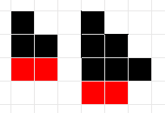

# Летние школы Академии Яндекса 2022. Занятие 1 (Разбор случаев, линейный поиск)  

   

## A. [Строительство лесенок](https://contest.yandex.ru/contest/39359/problems/A/)

- Ограничение времени	1 секунда
- Ограничение памяти	64Mb
- Ввод	стандартный ввод или input.txt
- Вывод	стандартный вывод или output.txt

   

> Вася занимается строительством лесенок из блоков.
> Лесенка состоит из ступенек, при этом i-ая ступенька должна состоять ровно из i блоков.
> По заданному числу блоков n определите максимальное количество ступенек в лесенке, 
> которую можно построить из этих блоков.

   

**Формат ввода**
Вводится одно число n (1 ≤ n ≤ 231 - 1).

**Формат вывода**
Выведите одно число — количество ступенек в лесенке.

 

|| Ввод | Вывод |
|-|-|-|
Пример 1 | 5 | 2
Пример 2 | 8 | 3

 

Примечания
Рисунок соответствует примерам. На рисунке черным показаны блоки, использованные при строительстве лестницы, а красным — оставшиеся лишними блоки, которых недостаточно для строительства очередной ступеньки.

  

   

----

   

## B. [Канонический путь](https://contest.yandex.ru/contest/39359/problems/B/)

- Ограничение времени	1 секунда
- Ограничение памяти	64Mb
- Ввод	стандартный ввод или input.txt
- Вывод	стандартный вывод или output.txt

   

> По заданной строке, являющейся абсолютным адресом в Unix-системе, вам необходимо получить канонический адрес.
> В Unix-системе "." соответсвутет текущей директории, ".." — родительской директории, при этом будем считать, что любое количество точек подряд, большее двух, соответствует директории с таким названием (состоящем из точек). "/" является разделителем вложенных директорий, причем несколько "/" подряд должны интерпретироваться как один "/".
> Канонический путь должен обладать следующими свойствами:
> 1) всегда начинаться с одного "/"
> 2) любые две вложенные директории разделяются ровно одним знаком "/"
> 3) путь не заканчивается "/" (за исключением корневой директории, состоящего только из символа "/")
> 4) в каноническом пути есть только директории, т.е. нет ни одного вхождения "." или ".." как соответствия текущей или родительской директории

   

**Формат ввода**
Вводится строка с абсолютным адресом, её длина не превосходит 100.

**Формат вывода**
Выведите канонический путь.

 

|| Ввод | Вывод |
|-|-|-|
Пример 1 | /home/ | /home
Пример 2 | /../ | / 
Пример 3 | /home//foo/ | /home/foo

 

Примечания
В первом примере необходимо убрать "/" в конце строки

Во втором примере нельзя подняться выше корневой директории

В третьем примере несколко подряд идущих "/" должны замениться на один, а также необходимо убрать "/" в конце строки

 

----

 

## C. [Купить и продать](https://contest.yandex.ru/contest/39359/problems/C/)

- Ограничение времени	1 секунда
- Ограничение памяти	64Mb
- Ввод	стандартный ввод или input.txt
- Вывод	стандартный вывод или output.txt

   

> У вас есть 1000$, которую вы планируете эффективно вложить. 
> Вам даны цены за 1000 кубометров газа за n дней. 
> Можно один раз купить газ на все деньги в день i 
> и продать его в один из последующих дней j, i < j.
> Определите номера дней для покупки и продажи газа для получения максимальной прибыли.

   

**Формат ввода**
В первой строке вводится число дней n (1 ≤ n ≤ 100000).
Во второй строке вводится n чисел — цены за 1000 кубометров газа в каждый из дней. Цена — целое число от 1 до 5000. Дни нумеруются с единицы.

**Формат вывода**
Выведите два числа i и j — номера дней для покупки и продажи газа. Если прибыль получить невозможно, выведите два нуля.

|| Ввод | Вывод |
|-|-|-|
Пример 1    | 6   10 3 5 3 11 9 | 2 5    |
Пример 2    | 4   5 5 5 5 | 0 0    |

 

----

 

## D. [Разница во времени](https://contest.yandex.ru/contest/39359/problems/D/)

- Ограничение времени	1 секунда
- Ограничение памяти	64Mb
- Ввод	стандартный ввод или input.txt
- Вывод	стандартный вывод или output.txt

   

> Каждые сутки на вокзал прибывает n электричек. 
> По заданному расписанию прибытия электричек определите 
> минимальное время между прибытием двух разных электричек.

   

**Формат ввода**
В первой строке задано число n (1 ≤ n ≤ 2 × 104) — количество электричек. 
Во второй строке задано n моментов времени в формате HH:MM (0 ≤ HH ≤ 23, 0 ≤ MM ≤ 59) через пробел.

**Формат вывода**
Выведите одно число — минимальное время в минутах между прибытием двух электричек.

|| Ввод | Вывод |
|-|-|-|
Пример 1    | 2   23:59 00:00 | 1    |
Пример 2    | 3   00:00 23:59 00:00 | 0    |

 

----

 

## E. [Сломай палиндром](https://contest.yandex.ru/contest/39359/problems/E/)

- Ограничение времени	1 секунда
- Ограничение памяти	64Mb
- Ввод	стандартный ввод или input.txt
- Вывод	стандартный вывод или output.txt

   

> Палиндромом называется строка, которая читается одинаково слева-направо и справа-налево.   В заданной строке-палиндроме необходимо заменить один символ, чтобы она перестала быть палиндромом.  При этом полученная строка должна быть лексикографически минимальной.  Строка A лексикографически меньше строки B (той же длины), если на первой различающейся позиции в строке A стоит меньший символ, чем в B.   Например, строка adbc меньше строки adca, т.к. первые два символа в строках совпадают, а на третьем месте в строке adbc стоит символ b, который меньше символа c, стоящего на третьей позиции в строке adca.

   

**Формат ввода**
Вводится строка-палиндром, состоящая из маленьких букв латинского алфавита. Длина строки не превосходит 1000. 

**Формат вывода**
Выведите лексикографически минимальную строку, не являющуюяся палиндромом, полученную из исходной строки заменой одного символа. Если получить такую строку невозможно - выведите пустую строк

|| Ввод | Вывод |
|-|-|-|
Пример 1 | abba | aaba |
Пример 2 | a |   |
